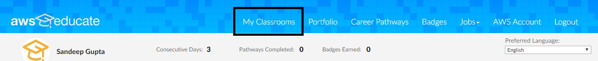
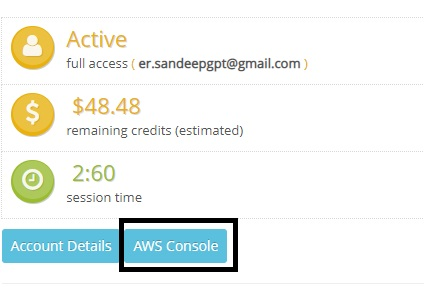
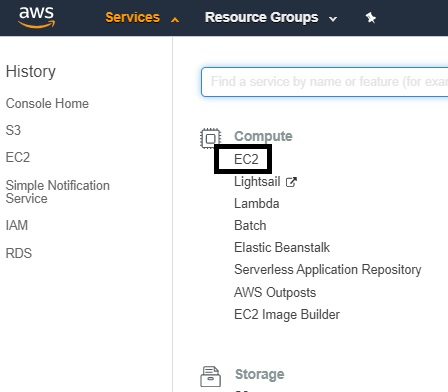
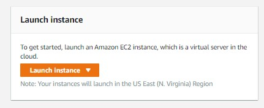

**Amazon Elastic Compute Cloud (Amazon EC2)** is an IAAS service model by AWS that provides secure, resizable compute capacity in the cloud.
It gives us the required infrastucture i.e. computing capability with required **CPU,RAM & VOLUME (hardisk or ssd)** along with the operating system of user's choice.
Hence we can virtually achieve comuting capability of 1000s of Gigabytes of RAM and Multicore CPU with Terrabytes of ssd/hdd along with desired operating system which is licenced
and managed by the aws and access that virtual machine remotely from our computers. This gives us the freedom and ability to have multiple virtual computers with different
operating systems according to our choice and pay minimum amount of the same.

EC2 instances are Scalable on demand, which means we can Increase or decrease capacity within minutes.

**How to create an EC2 instance?**

**Step 1 :** Create an account in AWS portal. [click here](https://portal.aws.amazon.com/billing/signup#/start)

**Step 2 :** Signin to aws educate [click here](https://www.awseducate.com/student/s/).
		-> click on My Classroom 

		-> Click on Go to classroom
		-> A new window will open which will look like image below. Click on **AWS comsole**

**Step 3 :** Click on dropdown next to services and click on EC2

**Step 4 :** Look for **Launch instance** panel and click on **Launch instance**.

