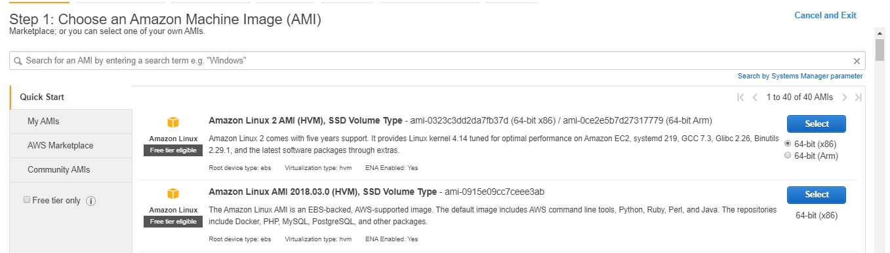
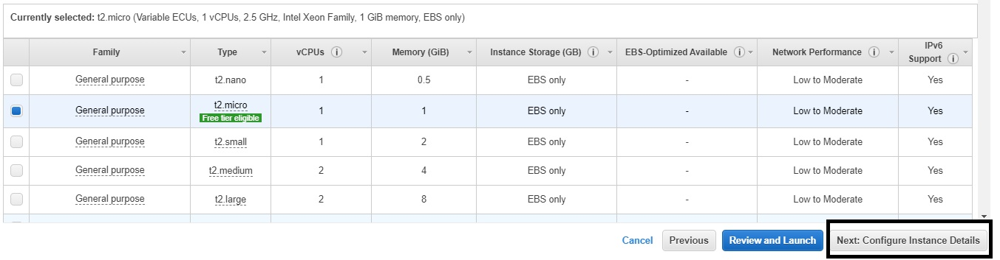
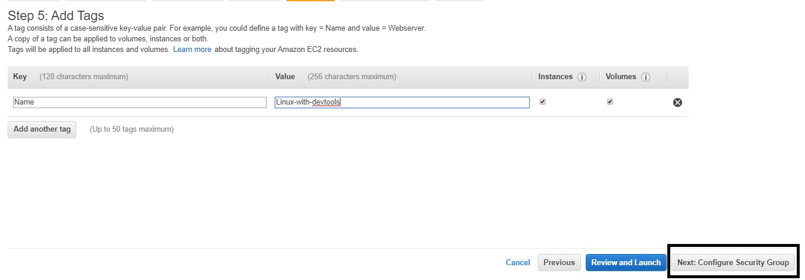
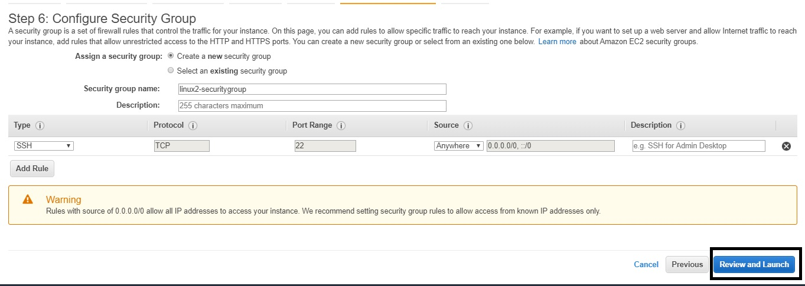
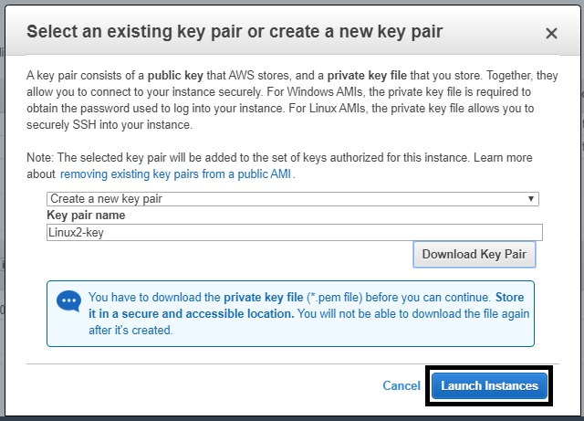

**Amazon Elastic Compute Cloud (Amazon EC2)** is an IAAS service model by AWS that provides secure, resizable compute capacity in the cloud.
It gives us the required infrastucture i.e. computing capability with required **CPU,RAM & VOLUME (hardisk or ssd)** along with the operating system of user's choice.
Hence we can virtually achieve comuting capability of 1000s of Gigabytes of RAM and Multicore CPU with Terrabytes of ssd/hdd along with desired operating system which is licenced
and managed by the aws and access that virtual machine remotely from our computers. This gives us the freedom and ability to have multiple virtual computers with different
operating systems according to our choice and pay minimum amount of the same.

EC2 instances are Scalable on demand, which means we can Increase or decrease capacity within minutes.

**How to create an EC2 instance?**
**SECTION A** - Setting up aws .

**Step 1 :** Create an account in AWS portal. [click here](https://portal.aws.amazon.com/billing/signup#/start)

**Step 2 :** Signin to aws educate [click here](https://www.awseducate.com/student/s/).
		-> click on My Classroom 

		-> Click on Go to classroom
		-> A new window will open which will look like image below. Click on **AWS comsole**

**SECTION B** - Creating EC2 instance.

**Step 1 :** Click on dropdown next to services and click on EC2

**Step 2 :** Look for **Launch instance** panel and click on **Launch instance**.

**Step 3 :** Select any AMI you want. Let's say here we select Amazon Linux AMI 2018.03.0 (HVM) . click on **select**.

AMI or Amazon Machine Image is like an iso file of the operating system you want to install. Amazon has added some developer softwares in their AMI for ease of developers. Choose accordingly.

**Step 4 :** Choose the instance type according to the configuration you want and click on **Next:Configure Instance Details**. **Donot** click on **review and lauch untill** you reach the last step.

**Step 5 :** On the Configure instance page You can select options what you want. It's ok if you dont select or change anything here Click on **Next:Add Storage**.

**Step 6 :** Input the size of volume you require. Default is 8GB. Input atleast 50GB for better performance and future needs. You can choose the volume type and encryption method if needed. Click on **Next:Add Tags**

**Step 7 :** Click on add tag. You will find key-value pair. Input **Name** in key. In value you may give your machine whatever name 
you like. Click on **Next: Congigure Security Group**

**Step 8 :** You need a port to coonect to this virtual linux machine/instance remotely. Security group helps you configure type, ports, source.
Linux uses **SSH** type to connect remontely.
In source you can select from where you want to be able to access this instance i.e **ANYWHERE**(from anywhere in the world on any computer) or **MY IP** (from a specific computer only. You wont be able to connect to this instance using any other computer). Click on **Review Changes**.

**Step 9 :** Review settings and options you have selected and if everthing feels right then click on **Launch**

**Step 10 :** You will get a pop-up like below asking about key-pair. Key-pair is the key to you instance. You cannot connect to an instance withouot a key. You can either use an exicting key or make a new key by giving it proper name. **MAKE SURE YOU DOWNLOAD THIS KEY-PAIR** in your computer (local) and keep it safe. If you lose this key, you loose your instance. Click on **Launch Instance** after downloading the key-pair. Note : One key-pair can be linked to multiple instamces.

Congratulations Your virtual Machine will be ready on sometime
**It will take some time to launch because creatinon process is happening in the backend.** you can connect yo this machine only after the creation process is finished.

Once you see **Running** status, you will be able to connect to this instance with your computer using the **IPv4 PUBLIC IP**.
